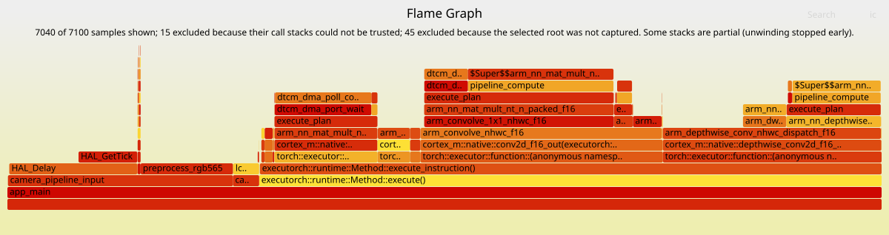
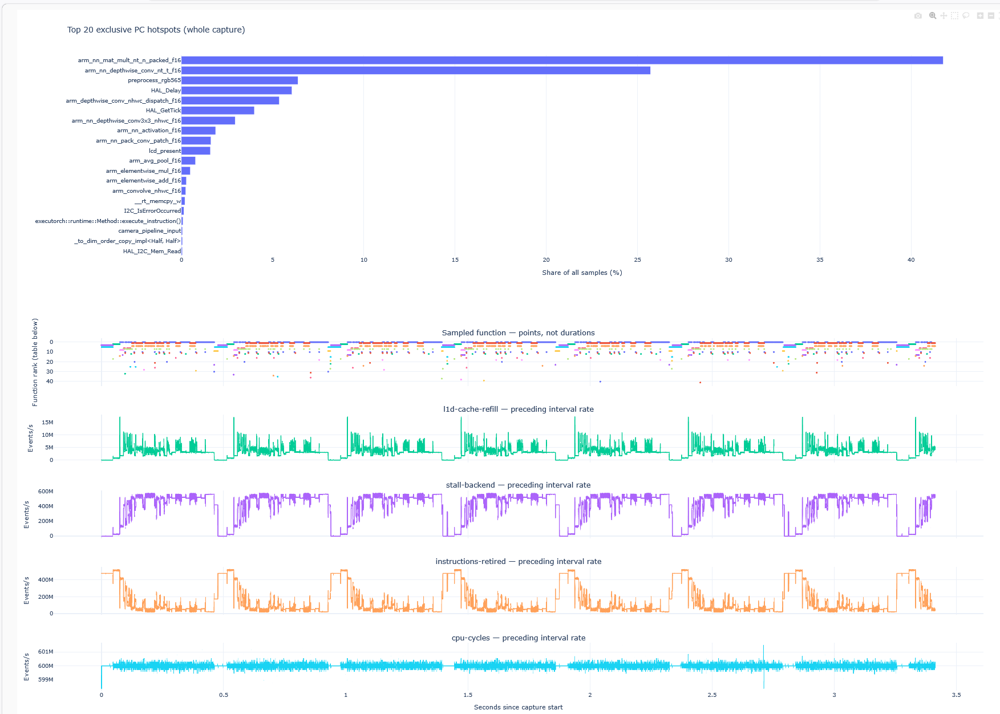

# CMSIS Statistical Profiler

Initial prototype. APIs and capture format may change.

Sample Cortex-M thread PCs into RAM, then decode them with the matching ELF/AXF.
Optional PMU counters report hardware events. The core supports M0 through M85;
board adapters or the generic SysTick integration supply the sampling timer.

Zephyr users should use its native [Perf profiling tool](https://docs.zephyrproject.org/latest/samples/subsys/profiling/perf/README.html#profiling-perf).
This pack is intended for applications outside Zephyr; see the linked sample for
Zephyr's supported targets and requirements.

## How it works

```text
Cortex-M application
   │  periodic interrupt at PROFILER_SAMPLE_HZ
   ▼
1. Timer integration
   ├─ Board timer adapter                adapters/<board>/
   └─ Exclusive generic SysTick          integrations/systick/
      └─ Own timer + IRQ; preserve interrupted stack and EXC_RETURN
           │
           ▼
2. Cortex-M backend                      mcu/sampling_profiler_cortex_m.c
   ├─ Acknowledge timer, read timestamp, check capture gate
   ├─ Validate exception frame and stack bounds
   └─ Extract PC/LR + optional PMU snapshots and bounded backtrace
           │  validated sample (or rejection reason)
           ▼
3. Capture core                          mcu/sampling_profiler.c
   └─ Append to RAM buffer sized by PROFILER_SAMPLE_BUFFER_BYTES
      (includes header and records; currently stops recording when full)
           │  stop capture, then dump via debugger / FVP semihosting
           ▼
Host decoder + matching ELF              host/analyze_profiler_buffer.py
   └─ Function hit percentages, sample timeline, PMU totals, diagnostics
```

For asymmetric multiprocessing (AMP), where each core runs its own firmware,
each core has its own instance of the 3 layers shown above: **Timer integration**,
**Cortex-M backend** and **Capture core**, with a separate buffer and host report.

## Get started

Follow the [3-stage integration guide](docs/INTEGRATION.md): PC sampling, PMU, then backtraces.

| Target | Guide |
|---|---|
| Corstone-300 FVP / MPS3 FPGA | [Runnable example](examples/corstone300/README.md) |
| STM32N6 | [TIM2 adapter](adapters/stm32n6/README.md) |
| Alif E8 | [UTIMER adapter](adapters/alif_e8/README.md) |
| NXP MIMXRT685 | [CTIMER4 adapter](adapters/nxp_rt685/README.md) |
| Himax WE2 / HX6538 | [TIMER4 adapter and UART retrieval](adapters/himax_we2/README.md) |
| Free SysTick | [Generic exclusive integration](integrations/systick/README.md) |
| CMSIS-RTOS2 | [RTX](examples/corstone300_rtos2/CALL_TREE.md) / [FreeRTOS](examples/corstone300_freertos/README.md) dual-thread Toolbox/FVP tests, [integration illustration](examples/corstone300_rtos2/README.md) |
| New board | [Adapter template](adapters/template/README.md) |

Select the common layer, 1 board and 1 board timer:

```yaml
layers:
  - layer: ../cmsis_statistical_profiler/cmsis_statistical_profiler.clayer.yml
  - layer: ../cmsis_statistical_profiler/adapters/corstone300/corstone300.clayer.yml
  - layer: ../cmsis_statistical_profiler/adapters/corstone300/corstone300_timer0.clayer.yml
```

Alternatively, select the common layer and the generic SysTick integration. A
board adapter is not required when the application directly supplies
`PROFILER_DEVICE_HEADER`, `SystemCoreClock`, readable stack bounds, startup/vector
ownership and linker placement:

```yaml
layers:
  - layer: ../cmsis_statistical_profiler/cmsis_statistical_profiler.clayer.yml
  - layer: ../cmsis_statistical_profiler/integrations/systick/systick.clayer.yml
```

The application supplies startup, clocks, linker placement and readable stack RAM.
Reserve the selected timer. The generic path requires free SysTick and owns its
handler; a board timer path leaves HAL/RTOS SysTick, PendSV and SVC ownership
unchanged. Supplied board adapters use secure M55 mappings; other targets using a
peripheral timer need an appropriate adapter.
M0/M0+/M1/M23 need a [custom timestamp](adapters/template/profiler_timestamp.c.example).
TCM is optional.

The generic SysTick path was hardware-validated on an Infineon PSOC Edge E84
platform with independent Cortex-M55 and Cortex-M33 RAM images. Both used 64 KiB
capture buffers and EHABI backtraces at 1 kHz with zero rejected frames or
unresolved PCs. The M55 captured four PMU events; the M33 correctly ran PC and
backtrace sampling without a PMU. This validation inherited board clocks and
power/security setup from already-running boot firmware; it does not replace the
Infineon BSP startup flow or validate coexistence with software that owns SysTick.

It was also validated on an NXP MIMXRT685-EVK Cortex-M33 RAM image at 1 kHz with
a 128 KiB buffer and 16-level EHABI backtraces. The completed capture contained
2,248 samples with zero rejected frames and zero unresolved PCs; 2,247 samples
reconstructed the expected A-F workload beneath the selected root. The Cortex-M33
correctly ran with `PROFILER_PMU_COUNT=0`. This test exposed an important Armv8-M
integration rule: infer the exception frame security state from `EXC_RETURN`, not
from the debugger's visible SCS alias. See the
[SysTick validation notes](integrations/systick/README.md#nxp-mimxrt685-evk-hardware-validation).

Set `PROFILER_SAMPLE_HZ` and `PROFILER_SAMPLE_BUFFER_BYTES` in your application
project or configuration header ([staged integration](docs/INTEGRATION.md)). A
64 KiB buffer holds 2,723
samples without PMU, 2,042 with 2 events or 1,634 with 4 events, without backtraces. Currently, recording
stops when the buffer is full; existing records are not overwritten. Circular
buffering and a repeated capture/export/resume workflow are planned: capture until
full, stop and finalize, export the buffer through the debugger, then resume capture.
See [configuration](docs/CONFIGURATION.md) for clocks, bounds and build options.

## Capture and decode

Call from privileged thread mode on the sampled core:

```c
if (!sampling_profiler_init())
    return;
sampling_profiler_enable();
run_your_workload();
sampling_profiler_stop(1, workload_output_is_correct());
```

The workload functions are placeholders. Always stop, even when full. Keep clocks
stable; avoid sleep, debugger halts and long interrupt masking during capture.
After `sampling_profiler_stop()` returns, halt the target. With the matching ELF
loaded in GDB, use [tools/export_profiler_buffer.gdb](tools/export_profiler_buffer.gdb) from the
repository root:

```gdb
source tools/export_profiler_buffer.gdb
export_profiler_buffer samples.bin
```

The helper checks that capture is complete and inactive, prints the header, and
dumps the whole buffer, including unused space. For AMP, stop all captures before
halting, then run it in each core's debugger context with its own ELF and filename.

For a packaged report, use [create_profiler_report.py](host/create_profiler_report.py);
it preserves inputs/provenance and links decoded data, Perfetto and optional plots.
See the [integration commands](docs/INTEGRATION.md).

Decode directly with Python 3.8+ and the exact unstripped executable:

```sh
python3 host/analyze_profiler_buffer.py --samples samples.bin --elf firmware.elf --output report
```

C++ function names are demangled automatically using `arm-none-eabi-c++filt`,
`llvm-cxxfilt` or `c++filt` from `PATH`. Use `--cxxfilt PATH` to select a tool, or
`--no-demangle` to retain ELF names. If the tool is unavailable or fails, the decoder
warns and keeps the original names. Regenerate the report and visualization to
update existing plots.

Outputs: `functions.csv`, `samples.csv`, `summary.json`, and `events.csv` for PMU
requests. Function percentages estimate sampled execution time, not call counts.
Samples aggregate tasks; task IDs are not recorded. Optional backtraces are
available for FlameGraph export (see below).
If timestamp clocks disagree, the host warns and marks `timing_valid=false`;
derived time fields are blank, while raw timestamps and PC/PMU reports remain available.

For AMP, use 1 profiler instance, buffer, timer channel and ELF per core.
See [Alif dual-core setup and retrieval](adapters/alif_e8/README.md). Reports stay
separate; independent timestamps are not automatically synchronized.

## Optional PMU

See the [Armv8.1-M Performance Monitoring User Guide](https://documentation-service.arm.com/static/63f365789567172d4e2aadf5)
for PMU events, counter chaining and usage guidance.

Set `PROFILER_PMU_COUNT` to 0-4 in your application (default 0). Each 32-bit
event uses 2 hardware counters. Default events, in order: D-cache refill (`0x0003`),
backend stall (`0x0024`), instructions retired (`0x0008`) and CPU cycles (`0x0011`).
Override `PROFILER_PMU_EVENT0` through `PROFILER_PMU_EVENT3` as needed. Records
use 24, 28, 32, 36 or 40 bytes for 0-4 active events.
Unavailable PMU collection falls back to PC sampling with a diagnostic status.

PMU counts cover init through stop, including interrupts and gated-off execution.
The host reports totals and interval deltas, without per-function attribution.
Overflow or incoherent reads invalidate derived counts.

## Optional backtraces and FlameGraph

Set `PROFILER_STACK_UNWIND=1` and `PROFILER_PRECISE_STACK_BOUNDS=1` in your application
to collect caller addresses. `PROFILER_UNWIND_MAX_DEPTH` defaults to 16;
each sample stores only its recovered callers (4-byte metadata + 4 bytes/caller). This requires
compiler-generated EHABI tables, a linker-table hook and precise stack bounds.
The decoder exports `stacks.folded` and trace-status diagnostics; incomplete traces
remain visible without diagnostic frames; unreliable chains are excluded with counts.
Use `--stack-root osThreadEntry` to select the graph base. See [setup and limitations](docs/UNWINDING.md).



*Example flamegraph: F16 MobileNetV3 on STM32N6. Frame widths represent included
sample counts, not call counts or per-function PMU totals.*

## Visualize reports: HTML and Perfetto

[host/visualize_profiler_report.py](host/visualize_profiler_report.py) converts a decoded report
into a Perfetto trace and, optionally, an interactive HTML dashboard. It reads
`samples.csv` and `summary.json` from the same decoder run. No connected board,
firmware rebuild or ELF is needed at this stage; symbolization is already done.
Use the matching ELF when running `analyze_profiler_buffer.py` first.



*Example HTML dashboard: F16 MobileNetV3 on STM32N6, showing sampled function
shares and PMU event rates over time.*

Run these commands from the repository root. `REPORT_DIR` can be outside the
repository; keep confidential captures and generated reports out of version control.

```sh
python3 host/visualize_profiler_report.py --report REPORT_DIR
```

This writes `REPORT_DIR/samples.perfetto.json` using only the Python standard
library. To also generate HTML, install the optional visualization dependency
in your Python environment:

```sh
python3 -m pip install -r host/requirements-visualization.txt
python3 host/visualize_profiler_report.py --report REPORT_DIR --html
```

This additionally writes `REPORT_DIR/dashboard.html`. Open it in a browser, or
launch it with Python using the absolute file path:

```sh
python3 -m webbrowser "file:///absolute/path/to/report/dashboard.html"
```

| Option | Purpose |
|---|---|
| `--report PATH` | Required directory containing `samples.csv` and `summary.json` |
| `--output PATH` | Output directory; defaults to the report directory |
| `--html` | Also create `dashboard.html`; requires Plotly |
| `--symbol-max-chars N` | Limit displayed function labels (default 120, minimum 40) |
| `--help` | Show command-line usage |

Existing exports with these names are overwritten; decoded CSV/JSON inputs are
unchanged. Use `--output` to retain multiple exports.

### HTML dashboard

- Top 20 function names by exclusive PC hits, plus a full function-name table.
- Individual PC samples with function, time, PC, LR and sample index on hover.
- 0-4 valid PMU event-rate graphs sharing the PC timeline's zoomable time axis.
- Capture warnings, validation status, PMU totals and ELF/capture hashes.
- Embedded Plotly JavaScript: works offline, with no CDN or server required.

Drag to zoom, double-click a plot to reset, click legend entries to hide functions,
or double-click a legend entry to isolate a function. Function rank 0 is the hottest
name in the table. Hotspot percentages and the table always describe the whole
capture, even when the timeline is zoomed. Identical function names are aggregated.

Long demangled names retain their beginning and end plus a stable eight-digit
SHA256 prefix ID, within the label limit. Full names remain in plot hover text
(wrapped for readability) and table tooltips. Click a table name to expand its
full, copyable signature. For example, use `--html --symbol-max-chars 100` for
shorter labels. Aggregation still uses the full name; CSV inputs are unchanged.

### Perfetto trace

Open `samples.perfetto.json` with **Open trace file** in an approved Perfetto UI.
For confidential data, use your approved local/self-hosted viewer and do not use
upload or sharing features. The exporter itself performs no network requests.

The Chrome JSON trace contains 1 instant event per PC sample, named after its
function, with PC/LR/index/tick arguments. PMU rates appear as counter tracks.
Long event names use the same compact labels; select an event to see its full
name in the `function` argument. The short ID is a display aid, not a unique
symbol key; use the full argument and PC for programmatic analysis.
A capture-information event contains warnings, limitations, hashes and PMU totals.
Timestamps use microseconds in JSON; Perfetto SQL uses nanoseconds.
No call stacks, function-duration spans or inference boundaries are inferred.

### Interpretation and validation

PMU rates are `interval_delta / actual_elapsed_seconds` between consecutive
samples. A value at time T describes the interval **ending** at T, not the time
after T; viewer lines/steps are not additional measurements. The initial PMU
interval is omitted because its epoch differs from the timestamp epoch. Final
unsampled time is also omitted, so plotted intervals need not sum to the full
initialization-to-stop totals.

These are raw event-rate plots, not smoothed curves, CPI, stall percentages or
cache-miss rates. PMU intervals include interrupts and gated-off execution and
must not be attributed to the function sampled at their endpoint. PC hits estimate
exclusive execution-time share, not calls or exact cycle counts. Fixed-rate
aliasing and interrupt latency remain limitations; LR is not a call stack.

Empty captures, invalid timing, non-increasing timestamps, inconsistent sample
counts and malformed PMU deltas are rejected. Disabled/invalid PMU suppresses
rate tracks while retaining valid PC samples. Full/incomplete captures, rejected
frames, failed workload validation and unresolved PCs produce warnings.
The exporter preserves supplied hashes but cannot independently verify that the
CSV, summary and original ELF belong together.

## Development

Run `python3 -B -m unittest discover -s tests -v`.
[GitHub Actions](.github/workflows/fvp.yml) builds with AC6 and checks an FVP PMU
capture against the [acceptance reference](tests/fvp_reference.json).
See [validation](tests/VALIDATION.md), [capture format](FORMAT.md),
[agent guide](AGENTS.md) and [TODO](TODO.md).
