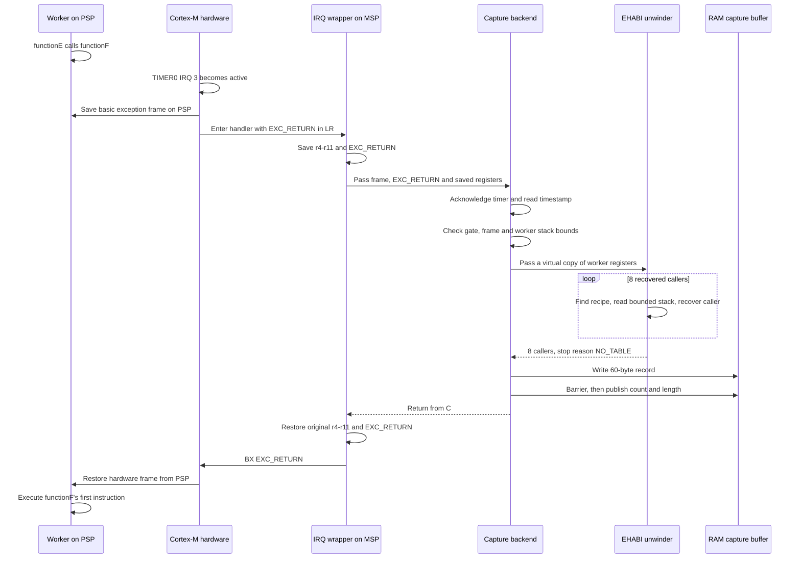

# Corstone-300 RTOS: inside the first sampling interrupt

This walkthrough follows **1 real TIMER0 interrupt** in a Corstone-300 FVP Tarmac
trace, from `269081 clk` until the worker resumes at `273599 clk`.
It explains the hardware save, the handler's own stack, caller recovery and the
record written to RAM. The application uses CMSIS-RTX, with 2 worker threads.

The key observation: **`functionE` has just called `functionF` when the interrupt
is taken. The saved PC belongs to `functionF`, even though the last executed
application instruction belongs to `functionE`.**

```text
Application instructions                       Sampling interrupt

functionE: NOP
           NOP
           BL functionF ----------------------+
                                              | hardware saves where to resume
functionF: first instruction   <--- paused     |
                                              +--> save remaining registers
                                                   acknowledge TIMER0
                                                   validate saved frame
                                                   reconstruct caller chain
                                                   append 1 record to RAM
                                              +--- restore original registers
           first instruction  <--- resumed ---+
           NOP
           ...
```

## 1. Example context

This walkthrough uses the [CMSIS-RTX call-tree example](../examples/corstone300_rtos2/CALL_TREE.md).
Addresses and counts illustrate 1 build; they are not fixed addresses to copy
into an application. Rebuilding can change both code placement and recipes.

The [annotated Tarmac trace](traces/corstone300-rtos-first-sample.tarmac) contains
the first `TFM_TIMER0_IRQ_Handler` occurrence, including its calls into the
backend, unwinder and record storage, with repetitive unwinding shortened. It starts at `269065 clk`, shortly
before the interrupt, and ends at `273622 clk`, after application execution resumes.
The first 2 caller-recovery steps are shown in full. A marked gap at
`270110..273286 clk` replaces the repeated recovery of the remaining callers.
The final caller store, unwind termination, record storage and exception return
are retained. Outside that gap, all register and memory events are preserved.
There is no nested interrupt or task switch in this interval.

Instruction lines end with `[function+offset]`, resolved from the matching ELF's
function address ranges. For example, `[profiler_port_barrier+0x0]` identifies
the first instruction of that function. These annotations were added for reading;
the preceding Tarmac event text is unchanged.

```text
269065..269080  functionE before the interrupt
269081         call to functionF; hardware exception entry
269082..273598  timer handler and return (repeated unwind steps abbreviated)
273599..273622  functionF resumes
```

The trace is an instruction-level illustration, not a hardware timing benchmark.

| Role | Source |
|---|---|
| Application | [call_tree_main.c](../examples/corstone300_rtos2/call_tree_main.c) |
| IRQ wrapper | [sampling_profiler_cortex_m.h](../mcu/sampling_profiler_cortex_m.h) |
| Timer adapter | [profiler_timer0.c](../adapters/corstone300/profiler_timer0.c) |
| Capture backend | [profiler_backend.c](../mcu/profiler_backend.c) |
| Unwinder | [sampling_profiler_unwind.c](../mcu/sampling_profiler_unwind.c) |
| Record storage | [sampling_profiler.c](../mcu/sampling_profiler.c) |

The trace's buffer-header writes establish these settings before the interrupt:

| Setting | Value |
|---|---|
| Requested sample rate | 333 Hz |
| Timer and timestamp reference frequency | 100,000,000 Hz |
| Timer period | 300,300 reference-counter ticks |
| Buffer allocation | 131,072 bytes, including a 176-byte header |
| Maximum recovered callers | 16 |
| PMU counters | 0; this RTOS capture has no PMU words |
| Records before this interrupt | 0 |
| Capture state | Active, not complete |

The full trace and executable are not bundled. The diagrams and decoded record
below explain the captured example; use your own matching ELF when inspecting a
new capture.

## 2. Reading the trace without knowing assembly

Consider:

```text
269082 clk IT (269082) 100075c4 4671 T handler_s : MOV r1,lr
   |        |            |      |        |          |
 position   executed     PC   encoding   mode       operation
 in trace   instruction
```

Useful event types are listed below. These meanings follow the
[Arm Tarmac format documentation](https://github.com/ARM-software/tarmac-trace-utilities/blob/main/doc/index.rst).

| Trace text | Plain meaning |
|---|---|
| `IT` | This instruction executed |
| `IS` | A conditional instruction was reached but its condition failed |
| `R r1 value` | Register `r1` changed to this value |
| `MW4 address value` | Write 4 bytes to memory |
| `MR4 address value` | Read 4 bytes from memory |
| `thread_s` | Secure Thread mode: ordinary application execution |
| `handler_s` | Secure Handler mode: exception/interrupt execution |
| `BL target` / `BLX register` | Call a function and set a return address |
| `PUSH` / `POP` | Save registers on a stack / restore registers from it |
| `BX register` | Branch to an address, or initiate exception return for a special token |

Here `T` indicates Thumb instruction state. `IT` in the event-type column is not
the same thing as an assembly instruction named `IT` that controls conditional
execution.

Treat `clk` as this trace's model time coordinate. Several memory/register
events can share it. It is neither the sample's stored timestamp nor, by itself,
a calibrated measurement of physical Cortex-M55 execution cycles.

The brackets appended by the annotation script, such as `[functionE]`, identify
the instruction's address. They do not identify its branch destination.

## 3. The application and its 2 stacks in use

The 2 workers execute different names so their call chains can be distinguished:

```text
CMSIS-RTX scheduler
   |
   +-- worker   -> run_once  -> A  -> B  -> C  -> D  -> E  -> F
   |
   +-- worker1  -> run_once1 -> A1 -> B1 -> C1 -> D1 -> E1 -> F1
   |
   +-- controller: starts capture, waits, then stops and exports it
```

Only 1 worker executes at a time on this CPU. At the first TIMER0 interrupt it is
`worker`, using the unsuffixed A-F functions. Each thread has an independent,
permanent 8 KiB stack. Sampling does not ask RTX to switch threads.

A **stack** is a RAM area used to save return addresses, registers and local
variables. On this Cortex-M setup, it grows toward lower addresses.

| Register | Meaning here |
|---|---|
| PC, `r15` | Program Counter: instruction address |
| LR, `r14` | Link Register: usually the function return address |
| SP, `r13` | Stack Pointer: selects the currently active stack |
| PSP | Process Stack Pointer: the running worker's stack |
| MSP | Main Stack Pointer: used by interrupt handlers |

```text
Worker stack, selected by PSP              Handler stack, selected by MSP

0x300020c0  +----------------------+        0x30080000  +----------------------+
           | worker/caller saves  |                    | older startup/kernel |
0x30002080  +----------------------+ <- PSP before IRQ  | stack use            |
           | room for hardware    |        0x3007ff98  +----------------------+ <- MSP before IRQ
           | exception frame      |                    | room for IRQ wrapper |
           |                      |                    | and C function frames|
0x300000c0  +----------------------+                    |                      |
           worker allocation bottom                   v grows down

The worker's saved frame goes on PSP.
The interrupt's own C calls use MSP.
These are different RAM areas, even though both stacks are on the same CPU.
```

The worker allocation ends at `0x300020c0` (exclusive). The other worker and the
controller have separate adjacent allocations. The unwinder must not read across
those allocation boundaries just because the surrounding memory is RAM.

## 4. At 269081: the call completes, then hardware takes the IRQ

The last application instruction is:

```text
269081 ... 10001182 f7fffcc7 ... BL 0x10000b14 [functionE]
269081 clk R r14 10001187
```

`BL` means “Branch with Link”: go to `functionF` and remember where to return.
This particular instruction occupies 4 bytes.

```text
functionE
0x10001182: BL functionF
0x10001186: next instruction after the call
                  ^
                  +-- return address stored in LR is 0x10001187
                      (bit 0 is the Thumb-state tag)

functionF
0x10000b14: first instruction     <-- the next instruction to execute
```

The interrupt happens before that first `functionF` instruction executes.
Consequently, hardware saves:

```text
saved PC = 0x10000b14       where execution must resume: functionF
saved LR = 0x10001187       where functionF will eventually return: functionE
```

The event identifies external interrupt 3:

```text
269081 ... PHASE=ACTIVATE ... PC=0x10000b14 VECTOR=EXT_INT3 ... SecurityState=S
269081 ... CoreEvent_EXT_INT3
```

Cortex-M exception numbers reserve the first 16 entries for core exceptions.
External IRQ 3 therefore has exception number `16 + 3 = 19 = 0x13`. That explains
the active exception value in the trace; it is not another interrupt source.
The vector selects `TFM_TIMER0_IRQ_Handler`. Its inherited platform name does not
mean Trusted Firmware-M is executing this handler.

## 5. Hardware creates a small “resume later” record on PSP

Before the first handler instruction, hardware writes 8 core registers into a
32-byte exception frame. These writes are automatic CPU behavior, not a C loop.

```text
Worker's original PSP = 0x30002080
                         |
                         | reserve 8 words = 32 bytes
                         v
Exception-frame PSP   = 0x30002060

Address       Offset   Saved register   Value
0x30002060     +0x00    r0               0x300060d4
0x30002064     +0x04    r1               0x000001c7
0x30002068     +0x08    r2               0x00000000
0x3000206c     +0x0c    r3               0x00000000
0x30002070     +0x10    r12              0x00000000
0x30002074     +0x14    LR               0x10001187   -> functionE
0x30002078     +0x18    PC               0x10000b14   -> functionF
0x3000207c     +0x1c    xPSR             0x01000000
0x30002080     +0x20    original stack continues here
```

`xPSR` is the saved processor-status register. Here its Thumb bit is set, its
exception-number field is 0 (the interrupted code was in Thread mode), and its
stack-alignment-padding bit is clear.

This is a basic frame: no floating-point extension and no alignment word. Other
samples can have a larger frame; the backend checks the saved frame description
instead of always assuming 32 bytes.

Notice what is absent: hardware has not put `r4-r11` in this basic frame. The
wrapper will save those before C code can change them.

## 6. LR now has a different job: EXC_RETURN

The original application LR is safely stored at `0x30002074`. In the handler,
hardware replaces live LR with `0xfffffffd`:

```text
Application LR                         Handler LR
0x10001187                             0xfffffffd
ordinary return to functionE           special EXC_RETURN token
        |                                      |
        +--> saved in the PSP frame             +--> describes exception return
```

`EXC_RETURN` tells the CPU how to restore the interrupted context. For this
secure Cortex-M55 sample:

| Field | Value | Meaning |
|---|---|---|
| Bits 31:7 | All 1 | Required EXC_RETURN prefix |
| Bit 6, S | 1 | The saved context uses the Secure stack |
| Bit 5, DCRS | 1 | Default callee-register stacking rules |
| Bit 4, FTYPE | 1 | Basic core-register frame; no FP extension |
| Bit 3, MODE | 1 | Return to Thread mode |
| Bit 2, SPSEL | 1 | Restore the frame from PSP |
| Bit 1 | 0 | Required reserved-bit value |
| Bit 0, ES | 1 | Exception was taken to Secure state |

The security fields above describe this Armv8-M build. They must not be applied
unchanged to older Cortex-M architectures.

There will also be ordinary function-call return addresses in LR while C
functions run inside the handler. Saving EXC_RETURN before making those calls is
essential: it must survive until the very end of the interrupt.

## 7. At 269082-269097: the small assembly wrapper preserves the worker

The wrapper runs before any compiler-generated C prologue:

```text
MOV  r1,lr         r1 = original EXC_RETURN = 0xfffffffd
TST  r1,#4         examine SPSEL: was the interrupted frame on PSP?
MRS  r0,PSP        r0 = 0x30002060, the hardware frame address
```

The actual `TST` sequence uses a scratch register containing 4. Because bit 2 is
set, the branch that would select MSP is not taken (`IS` in the trace).

The wrapper then reserves 40 bytes on MSP:

```text
Higher addresses
0x3007ff98  +------------------------+ <- MSP before wrapper
0x3007ff94  | padding: 4 bytes       |    keeps the C-call stack 8-byte aligned
0x3007ff90  | EXC_RETURN 0xfffffffd   |
0x3007ff8c  | original r7: 0         |
0x3007ff88  | original r6: 300060c4   |
0x3007ff84  | original r5: 1         |
0x3007ff80  | original r4: 300060cc   |
0x3007ff7c  | original r11: 0        |
0x3007ff78  | original r10: 0        |
0x3007ff74  | original r9: 0         |
0x3007ff70  | original r8: 0         | <- MSP after wrapper; r2 points here
           +------------------------+
Lower addresses
```

Why move `r8-r11` into `r4-r7` before pushing them? The shared wrapper also supports
small Cortex-M cores whose Thumb-1 `PUSH` instruction cannot directly save the
high registers. The original `r4-r7` have already been saved, so they can be used
as temporary transport without losing their original values.

At the C call, the first 3 argument registers are:

```text
r0 = 0x30002060   -> original hardware frame on the worker's PSP
r1 = 0xfffffffd  -> original EXC_RETURN
r2 = 0x3007ff70   -> original r8-r11, followed by original r4-r7

BLX statistical_sampling_tick
    LR becomes 0x100075eb: an ordinary return into the wrapper
```

## 8. At 269098: the C handler makes its own workspace

This push is different from the hardware save:

```text
269098 ... PUSH {r4-r10,lr}       32 bytes on MSP
269099 ... SUB sp,sp,#0xa8       168 more bytes on MSP
```

The compiler saves the registers its C function needs to preserve, then reserves
room for local objects. This does not create another interrupted application
frame. It provides working space for the profiler.

```text
MSP 0x3007ff70 before C prologue
          |
          +-- 32 bytes: C function's saved registers
          v
    0x3007ff50
          |
          +-- 168 bytes: local workspace
          v
    0x3007fea8

Within that workspace:
0x3007fea8 .. 0x3007fee7   regs[16]: virtual copy of the worker registers
0x3007fee8 ..             temporary sample: PC/LR, timestamp, caller array
0x3007ff48 .. 0x3007ff4f   selected stack bounds
```

The raw `PUSH` values here may already reflect wrapper scratch-register use.
They are not a replacement for the original-register snapshot at `0x3007ff70`.

## 9. Acknowledge TIMER0, timestamp the sample and check the gate

`profiler_timer_ack()` executes at `269104-269119`.
It confirms ownership and a real pending timer event, then acknowledges it:

```text
Read  0x5800002c -> 0x00000005   TIMER0 physical timer control/status
Read  0x5800004c -> 0x00000001   auto-increment control
Write 0x5800004c <- 0x00000001   clear interrupt using the adapter's write-zero rule
DSB                            wait for the peripheral write to complete
```

These addresses are offsets within the BSP's secure TIMER0 mapping. They are not
portable peripheral addresses. Acknowledging the timer prevents the same pending
event from immediately retriggering the handler; it does not stop periodic sampling.

The timestamp hook then reads the free-running reference counter:

```text
269124 clk MR4 58000000 000cd528

sample.timestamp = 0x000cd528 = 841,000 reference-counter ticks
```

The stored timestamp is read slightly after exception entry, before unwinding.
The saved PC still describes the interruption point, not the timestamp-hook PC.

The backend increments its sampling-interrupt count from 0 to 1, advances its
own millisecond bookkeeping to 3, and sees that the recording gate is enabled.
These counters belong to the profiler, not to RTX's SysTick.

```text
TIMER0 event
    |
    +--> acknowledge + timestamp + advance profiler time
    |
    +--> recording gate enabled?
                |
                +-- no: return without storing a sample
                +-- yes: validate the worker's saved frame
```

## 10. Validate the frame and identify the worker's stack

Before dereferencing the candidate frame, the backend checks the EXC_RETURN
layout and pointer alignment. `profiler_stack_bounds()` runs at `269173-269186`.

It reads PSP (`0x30002060`) and finds the containing permanent stack allocation:

```text
Readable DTCM RAM
+------------------------------------------------------------------+
| worker stack                                                     |
| 0x300000c0 .......................................... 0x300020c0  |
|                         ^                                        |
|                         PSP = 0x30002060                         |
|                                                                  |
| worker1 stack          controller stack            other RAM      |
+------------------------------------------------------------------+

Allowed unwinder reads = readable RAM intersected with this worker's stack
                        = [0x300000c0, 0x300020c0)
```

The upper limit is exclusive: the stack pointer may equal it after all saved
words have been consumed, but reading a word there is not allowed.

The backend checks that the hardware frame fits, then validates the stacked
xPSR. In this sample, all checks pass. The hook makes no RTX service call and
does not change which worker is running.

## 11. Build a virtual register set for unwinding

The unwinder needs the worker's register values, not the values currently used
by the handler. The backend combines its 2 saved sources:

```text
Hardware frame on PSP              Wrapper snapshot on MSP
r0-r3, r12, LR, PC                  r4-r11
          \                           /
           \                         /
            +--> virtual regs[16] <--+
                         |
                         +--> virtual SP = frame address + frame size

virtual SP = 0x30002060 + 32 = 0x30002080
virtual LR = 0x10001187
virtual PC = 0x10000b14
```

Trace writes at `269259` show those final 3 values:

```text
0x3007fedc <- 0x30002080     regs[SP]
0x3007fee0 <- 0x10001187     regs[LR]
0x3007fee4 <- 0x10000b14     regs[PC]
```

Changing `regs[SP]` or `regs[PC]` during unwinding changes this RAM copy only.
It does not move the real PSP or redirect CPU execution. This distinction is
what lets the profiler inspect callers and then resume the worker unchanged.

## 12. At 269264: unwind the application's call chain

`profiler_unwind_capture()` reserves another 96 bytes on MSP:
36 bytes for `{r4-r11,lr}`, followed by 60 bytes of local workspace.

```text
0x3007ff98  MSP before interrupt
    | 40 bytes: assembly wrapper
0x3007ff70
    | 200 bytes: statistical_sampling_tick
0x3007fea8
    | 96 bytes: profiler_unwind_capture
0x3007fe48  lowest observed MSP in this interrupt

Additional handler-stack use = 0x150 = 336 bytes
Worker hardware frame        = 32 bytes on a different stack
```

These are observed values for this build and path, not a worst-case stack budget
for other optimizations, nested interrupts or different recipes.

### How an unwind recipe works

EHABI means **Exception Handling Application Binary Interface**. The compiler
and linker supply compact descriptions of how to undo a function's stack usage.
The profiler interprets those descriptions without executing exception-handling
personality routines.

```text
virtual PC
    |
    v
.ARM.exidx: sorted index of code-range starts and recipe descriptions
    |
    +-- recipe fits in index word ------+
    |                                   |
    +-- recipe stored in .ARM.extab -----+--> decode a few bytes
                                                |
                                                v
                                      move virtual SP / read saved registers
                                                |
                                                v
                                          recover caller PC
```

### Where the index is stored

This ELF has 154 entries in its `.ARM.exidx` section. Each entry occupies 8 bytes:
1 word points to a code-range start using PREL31, and 1 word describes the recipe
or points to a longer recipe. This is a code-range index, not necessarily 1 entry
per function in every build.

The [linker script](../examples/corstone300/linker.ld) places the table in
Instruction Tightly Coupled Memory (ITCM), alongside the executable code. The
FVP loader loads it from the ELF into target memory before execution. The ISR
reads that memory directly; it does not open the ELF file during sampling.

```text
ELF file                            Target memory (this build)
                                    ITCM
.vectors -------------------------> 0x10000000  vector table
.text ----------------------------> 0x100007c0  code and read-only data
.ARM.exidx -----------------------> 0x1000a1c0  first index entry
  file offset: 0x1a1c0                  ...
  size: 0x4d0 = 1232 bytes           0x1000a210  entry describing functionF
  154 entries x 8 bytes                 ...
                                    0x1000a690  end of index (exclusive)

.ARM.extab has size 0 in this ELF: no out-of-line recipes are needed.
```

Some actual entries are shown below. The entry address is where the metadata
lives; the decoded range start is where the associated code lives. Function names
come from ELF symbols, not from strings inside the index.

| Entry address | Decoded range start | Symbol at that start | Recipe word |
|---|---|---|---|
| `0x1000a1e8` | `0x100009c8` | `worker` | `0x80aab0b0` |
| `0x1000a208` | `0x10000b08` | `Default_Handler` | `0x808408b0` |
| `0x1000a210` | `0x10000b14` | `functionF` | `0x80b0b0b0` |
| `0x1000a218` | `0x10000bec` | `functionE` | `0x808408b0` |
| `0x1000a220` | `0x10002570` | `functionD` | `0x808408b0` |
| `0x1000a228` | `0x10003234` | `functionC` | `0x808408b0` |

To list the table yourself, run `arm-none-eabi-readelf --unwind` on the matching
`profiler.elf`. Use `--sections` to see section addresses, sizes and file offsets.

### How binary search selects a recipe

The entries are sorted by their **decoded code-range starts**. Binary search
looks at the middle entry and discards the half that cannot contain the answer.
It repeats this on the remaining half, rather than reading all 154 entries.

For a middle entry whose start is:

- Greater than the virtual PC: search the lower half.
- Less than or equal to the virtual PC: search the upper half for a later start
  that might still fit. If none does, use this entry.

```text
154 possible entries
        |
        v   compare against the middle range start
    at most 77
        |
        v   compare again; discard another half
    at most 38
        |
        v
     19 -> 9 -> 4 -> 2 -> 1 -> answer

At most 8 middle-entry comparisons for this 154-entry table.
```

The answer is the last range start not greater than the lookup address. Here:

```text
Code address:   0x10000b08       0x10000b14             0x10000bec
                    |               |                      |
Range:          Default_Handler     functionF               functionE
                                    ^
Virtual PC:                         0x10000b14
                                    |
Selected metadata:                  entry at 0x1000a210
```

So yes: the entry at `0x1000a210` is the one selected for the initial virtual PC
`0x10000b14`. It also describes lookup addresses up to, but excluding,
`0x10000bec`, the next range start.

Each recovered caller needs another lookup and recipe interpretation. For caller
return addresses, the backend first moves the lookup address back into the call
instruction; the initial interrupted PC is used directly. The many trace
instructions here are mostly validation and interpretation, not recursive
execution of application functions.

The format is defined in the [Arm EHABI specification](https://github.com/ARM-software/abi-aa/blob/main/ehabi32/ehabi32.rst#103-frame-unwinding-instructions).
The profiler's named encodings are in [profiler_ehabi.h](../mcu/profiler_ehabi.h).

### First step: functionF needs only the saved LR

The trace reads `functionF`'s index entry:

```text
Address       Word          Meaning
0x1000a210    0x7fff6904    PREL31 offset to functionF
0x1000a214    0x80b0b0b0    compact personality 0: finish

PREL31 = signed 31-bit offset relative to the word containing it
0x1000a210 + (-0x96fc) = 0x10000b14 = functionF
```

The recipe bytes are interpreted most-significant first:

```text
0x80b0b0b0
  | | | |
  | +------+-- opcode bytes: B0 B0 B0
  +----------- compact-format/personality tag

B0 = finish
No saved PC was restored, so virtual PC takes virtual LR.
```

`functionF` is a leaf in this build: it has no further function calls and no
stack-saving prologue. Its recipe does not pop the stack.

```text
Before virtual step                  After virtual step
PC = 0x10000b14  functionF            PC = 0x10001187  return into functionE
SP = 0x30002080                      SP = 0x30002080  unchanged
LR = 0x10001187

Caller[0] = 0x10001187, committed at 269592
```

An unchanged SP is therefore legitimate. Rejecting every unchanged-SP step would
incorrectly discard leaf functions.

### Second step: functionE saved r7 and LR

For recovered return addresses, the lookup clears the Thumb bit and subtracts
2 bytes to land inside the call instruction:

```text
raw return address:       0x10001187
clear Thumb tag:          0x10001186
look up preceding halfword:0x10001184  inside the BL at 0x10001182
```

Subtracting 2 does not claim the call instruction is always 2 bytes long. It
selects an address inside the instruction immediately preceding the return.

`functionE` has recipe `0x808408b0`:

```text
80 | 84 08 | B0
 |     |     +-- finish: use restored LR as caller PC
 |     +-------- pop saved r7 and LR from the virtual stack
 +-------------- compact personality 0
```

The trace shows exactly which application-stack words are read:

```text
virtual SP = 0x30002080

0x30002080  saved r7 = 0x00000000      read at 269933
0x30002084  saved LR = 0x1000309f      read at 270005
0x30002088  next caller's stack       new virtual SP

Caller[1] = 0x1000309f -> functionD, committed at 270108
```

The read operation is bounded by the worker's stack allocation. Nothing is
popped from the live worker stack: “pop” here describes updates to the virtual
register array.

### Continue through the caller chain

Each row below is 1 successful unwind step. SP values are virtual, and the
commit time is the write into the temporary caller array on MSP.

| Function being unwound | Virtual SP before | Virtual SP after | Recovered return address | Caller | Commit `clk` |
|---|---|---|---|---|---|
| `functionF` | `0x30002080` | `0x30002080` | `0x10001187` | `functionE` | 269592 |
| `functionE` | `0x30002080` | `0x30002088` | `0x1000309f` | `functionD` | 270108 |
| `functionD` | `0x30002088` | `0x30002090` | `0x1000323b` | `functionC` | 270624 |
| `functionC` | `0x30002090` | `0x30002098` | `0x1000389f` | `functionB` | 271140 |
| `functionB` | `0x30002098` | `0x300020a0` | `0x10003bd3` | `functionA` | 271668 |
| `functionA` | `0x300020a0` | `0x300020a8` | `0x10003d7b` | `run_once` | 272196 |
| `run_once` | `0x300020a8` | `0x300020b0` | `0x100009ed` | `worker` | 272712 |
| `worker` | `0x300020b0` | `0x300020c0` | `0x1000993f` | `osThreadEntry` | 273287 |

A-E and `run_once` use the 8-byte `{r7,lr}` recipe. `worker` uses a 16-byte
`{r4,r5,r6,lr}` recipe. That accounts for the different final SP increment.

```text
Older callers                          Recovery direction
osThreadEntry                                 ^
  worker                                      |
    run_once                                  |
      functionA                               |
        functionB                             |
          functionC                           |
            functionD                         |
              functionE                       |
                functionF  <- sampled PC -----+
```

### Why recovery stops at osThreadEntry

`osThreadEntry` has an EXIDX entry marked `CANTUNWIND` (`0x00000001`). This is an
explicit “no usable recipe” marker. The profiler stops and keeps the 8 callers
already recovered. It does not guess a parent or read another thread's memory.

At `273493` it writes:

```text
sample.unwind = 0x00000108
                       ||
                       |+-- low byte 0x08: 8 initialized caller entries
                       +--- next byte 0x01: PROFILER_UNWIND_NO_TABLE
```

The depth limit is 16, but only 8 caller addresses are stored. The sampled PC is
separate, so this record describes 9 function levels including `functionF`.

## 13. At 273498: append the record to the capture buffer

The unwinder returns to `statistical_sampling_tick`, which calls
`profiler_record()`. That function uses 40 bytes of MSP workspace; the 96-byte
unwinder frame has already been released, so these 2 stack costs do not add
on top of each other.

The global buffer starts at `0x30006120`. Its first 176 bytes are the header,
so the first record starts at `0x300061d0`.

```text
statistical_samples at 0x30006120
+--------------------------------------+ 0x30006120
| Header: configuration and progress   | 176 bytes
+--------------------------------------+ 0x300061d0
| 6 base words                         | 24 bytes
| unwind depth/status                  |  4 bytes
| 8 recovered caller addresses         | 32 bytes
+--------------------------------------+ 0x3000620c
| Space for subsequent records         |
| ...                                  |
+--------------------------------------+ 0x30026120 (exclusive buffer end)

Record length = 24 + 4 + 8*4 = 60 bytes
No PMU words and no padding for the 8 unused caller slots.
```

The trace writes this record:

| Address | Field | Value |
|---|---|---|
| `0x300061d0` | Timestamp | `0x000cd528` |
| `0x300061d4` | Sampling tick | `1` |
| `0x300061d8` | Sampled PC | `0x10000b14` |
| `0x300061dc` | Saved application LR | `0x10001187` |
| `0x300061e0` | Saved xPSR | `0x01000000` |
| `0x300061e4` | EXC_RETURN | `0xfffffffd` |
| `0x300061e8` | Unwind metadata | `0x00000108` |
| `0x300061ec` | Caller 0 | `0x10001187` |
| `0x300061f0` | Caller 1 | `0x1000309f` |
| `0x300061f4` | Caller 2 | `0x1000323b` |
| `0x300061f8` | Caller 3 | `0x1000389f` |
| `0x300061fc` | Caller 4 | `0x10003bd3` |
| `0x30006200` | Caller 5 | `0x10003d7b` |
| `0x30006204` | Caller 6 | `0x100009ed` |
| `0x30006208` | Caller 7 | `0x1000993f` |

The saved LR appears again as Caller 0 because the first unwind step recovered
the leaf's caller from LR. That is expected, not an accidental duplicate frame.

After writing the data, the handler executes a Data Memory Barrier (`DMB`) at
`273576`, then updates `bytes_used` to 60 at `273579` and `count` to 1 at `273581`.

```text
write record contents -> DMB -> publish bytes_used=60 -> publish count=1
```

The barrier orders publication; it does not export the buffer or clean a data
cache. The normal workflow still requires `profiler_stop()` before dumping.

## 14. At 273588-273599: restore and resume

The C function releases its local workspace and returns into the wrapper.
The wrapper restores its snapshot in the opposite order from the save:

```text
273588-273589   release statistical_sampling_tick frame; MSP = 0x3007ff70
273590         pop saved high-register values into temporary r4-r7
273591-273594   move those values back to r8-r11
273595         pop original r4-r7
273596         pop saved EXC_RETURN into r3 = 0xfffffffd
273597         discard alignment padding; MSP = 0x3007ff98
273598         BX r3 -> hardware recognizes exception return
```

This last `BX` does not try to execute an instruction at `0xfffffffd`.
It requests hardware restoration from the PSP frame selected by EXC_RETURN.

```text
                     hardware restores
PSP frame --------------------------------------> CPU registers
0x30002060: r0                                     r0 = 0x300060d4
...                                               ...
0x30002074: LR                                     LR = 0x10001187
0x30002078: PC                                     PC = 0x10000b14
0x3000207c: xPSR                                   Thread mode / Thumb state

PSP: 0x30002060 -> 0x30002080
MSP: remains at its pre-interrupt value 0x3007ff98
```

At `273599` the first instruction of `functionF` finally executes:

```text
273599 ... 10000b14 f24600d4 T thread_s : MOV r0,#0x60d4 [functionF]
```

The application continues the same function call on the same worker stack.
The interruption did not invoke the scheduler or switch to `worker1`.

## 15. The whole interruption as a conversation



The arrows from hardware to the worker represent stack saves/restores, not
ordinary calls into the worker's application code.

## 16. Why the unwinder dominates this trace

The handler occupies positions `269082` through `273598`, inclusive:
4,517 instruction-event positions, comprising 4,018 executed `IT` entries and
499 condition-failed `IS` entries.

| Phase | First position | Last position | Positions |
|---|---:|---:|---:|
| Assembly entry | 269082 | 269097 | 16 |
| Backend before unwinding, including hooks | 269098 | 269263 | 166 |
| Unwinder, including its prologue/epilogue | 269264 | 273495 | 4,232 |
| Backend call setup for storage | 273496 | 273497 | 2 |
| Record storage, including barrier call | 273498 | 273587 | 90 |
| Backend return | 273588 | 273589 | 2 |
| Assembly restoration and exception return | 273590 | 273598 | 9 |

```text
Approximate share of this handler's instruction-event positions

unwind    [###############################################   ] 93.7%
all else  [###                                               ]  6.3%
```

The unwinder repeatedly searches tables, decodes bytes, checks stack bounds,
restores virtual registers and validates caller addresses. No separate
`recipe()` or `step()` calls appear in this interval because their work is
compiled into `profiler_unwind_capture()` in this ELF.

These figures explain where the model's instruction work goes. They do not give
physical CPU cycle costs: the event count includes failed conditional
instructions, and real hardware memory latency and pipeline behavior differ.
Disabling caller recovery would remove that work, but its exact performance
benefit requires a separate measurement with the corresponding build.

There are also 2 different clocks in the discussion:

```text
Trace coordinate                      Stored sample timestamp
269124 clk                            841000 reference ticks
  |                                     |
  +-- locate the LDR in the trace        +-- 100 MHz hardware/model counter
                                            used for capture timing
```

The header's start timestamp is 540,522, so the first sampled timestamp is
300,478 reference ticks, or 3.00478 ms, after that recorded epoch. This includes
setup/interrupt/read offsets; it is not a measurement of the unwinder's duration.
The configured timer period is 300,300 reference ticks, or 3.003 ms.

## 17. What the host can show later

The raw caller list is ordered from the nearest caller outward. A flamegraph
uses the opposite order, then appends the sampled function:

```text
Stored nearest-first callers:
E, D, C, B, A, run_once, worker, osThreadEntry

Displayed root-first stack:
osThreadEntry -> worker -> run_once -> A -> B -> C -> D -> E -> F
```

For this record, the host reports `no_table`, keeps the sample as `included`,
and produces this folded contribution when rooted at `osThreadEntry`:

```text
osThreadEntry;worker;run_once;functionA;functionB;functionC;functionD;functionE;functionF 1
```

The final `1` means 1 included sample, not 1 function invocation. With only this
sample, every displayed frame has width 1. A useful flamegraph combines many
samples from the completed capture.

Why does entry filtering keep this particular `functionF` sample? The host
recognizes its exact finish-only EHABI recipe and checks that its first recovered
caller equals the saved LR. A function with a stack-changing prologue can be
unsafe to unwind at its first instruction, and would be treated differently.
This does not make asynchronous EHABI recovery universally reliable.

A snapshot immediately after this first interrupt is still **active and
incomplete**. The normal decoder correctly refuses to treat it as a finished
capture. Wait for the controller to stop profiling, then export and decode the
whole buffer.

## 18. Inspect your own build

Follow the [RTX example guide](../examples/corstone300_rtos2/CALL_TREE.md) to build
and run the application. Keep each capture and trace with the exact executable
that produced them. Compare the [annotated trace](traces/corstone300-rtos-first-sample.tarmac)
with your trace by following the same handler stages; addresses will differ.

Inspect instructions and unwind recipes with standard Arm GNU tools, replacing
`path/to/profiler.elf` with your executable:

```sh
arm-none-eabi-objdump -d path/to/profiler.elf | less
arm-none-eabi-readelf --unwind path/to/profiler.elf | less
arm-none-eabi-readelf --sections path/to/profiler.elf | less
```

See [UNWINDING.md](UNWINDING.md) for integration requirements and limitations.
